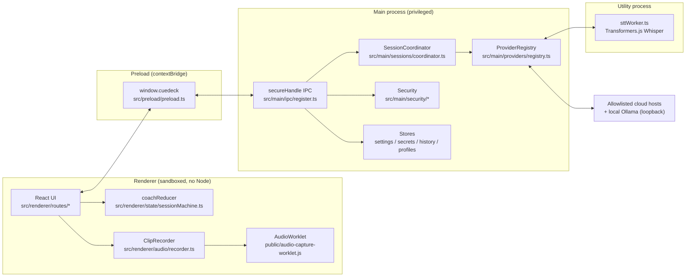

# CueDeck Architecture

This is a guided tour of the CueDeck codebase for engineers who are new to it (and possibly new to Electron). Everything in this document was derived from the source files cited inline — when the doc and the code disagree, the code wins, and please fix the doc.

CueDeck is a Windows desktop app that records a short clip of the computer's own audio ("system audio"), transcribes it with a speech-to-text (STT) provider, and streams a suggested spoken response from a large language model (LLM). It is local-first: the default configuration (local Whisper + Ollama) never sends audio or text off the device.

## 1. The process model

Electron apps are not one program; they are several cooperating OS processes with very different privilege levels. CueDeck uses four kinds:

| Process | Source root | Privileges | Role |
|---|---|---|---|
| **Main** | `src/main/` | Full Node.js + Electron APIs | Owns windows, settings, secrets, network calls, the session pipeline |
| **Preload** | `src/preload/preload.ts` | Limited bridge context | Exposes a fixed, typed API to the page |
| **Renderer** | `src/renderer/` | None (sandboxed browser page) | React UI only |
| **Utility (STT worker)** | `src/main/workers/sttWorker.ts` | Node.js, separate process | Runs Whisper inference via Transformers.js |

**Why the split?** The renderer displays a lot of untrusted-ish data (transcripts from arbitrary audio, streamed model output). If the renderer were compromised, we do not want it to be able to read API keys, open sockets to arbitrary hosts, or touch the filesystem. So the renderer is created with `sandbox: true`, `contextIsolation: true`, and `nodeIntegration: false` (see `SECURE_PREFERENCES` in `src/main/windows/windows.ts`). Quick glossary:

- **contextIsolation** — the preload script and the web page run in separate JavaScript worlds; the page cannot reach into preload's variables or Electron internals. The only way across is `contextBridge`.
- **sandbox** — the renderer runs in Chromium's OS-level sandbox with no Node.js at all. `window.require`, `window.process`, etc. do not exist (asserted by the e2e test `test/e2e/app.spec.ts`, "renderer is sandboxed...").
- **IPC (inter-process communication)** — message passing between renderer and main over named channels (`ipcRenderer.invoke` / `ipcMain.handle`). The renderer never sees channel names or `ipcRenderer` directly; it only sees the frozen API object the preload exposes.
- **utility process** — an Electron-managed child Node process (`utilityProcess.fork`). CueDeck runs Whisper inference there so a multi-hundred-MB model load or a crashed ONNX runtime cannot take down the main process, and so cancellation can simply kill the process (see `src/main/workers/sttWorkerManager.ts`).
- **fuses** — build-time switches baked into the packaged binary that permanently disable Electron escape hatches (`ELECTRON_RUN_AS_NODE`, `NODE_OPTIONS`, `--inspect`, loading code from outside the asar archive). Configured in `forge.config.ts` via `FusesPlugin`.
- **safeStorage / DPAPI** — Electron's `safeStorage` encrypts strings with the OS keychain; on Windows this is DPAPI, which ties decryption to the logged-in Windows user. Used by `src/main/settings/secretVault.ts` for API keys.



### Build wiring

Electron Forge + Vite builds four bundles (see `forge.config.ts`): `src/main/main.ts` (main), `src/preload/preload.ts` (preload), `src/main/workers/sttWorker.ts` (worker, built as a *main*-target CJS bundle with `@huggingface/transformers` kept external — see `vite.worker.config.ts`), and one renderer named `main_window`. Both app windows (Coach and Preferences) load the same renderer bundle; they differ only by URL hash (`#/` vs `#/preferences`), routed in `src/renderer/App.tsx` by a tiny hash-router hook.

Startup order lives in `src/main/main.ts` → `bootstrap()`: construct stores and the `CaptureGrant` → construct `SttWorkerManager` → register all providers into a `ProviderRegistry` → build `Diagnostics` and `SessionCoordinator` → `hardenSession()` → install the display-media handler → `registerIpc(services)` → create the coach window.

## 2. One "Listen" session, end to end

This is the single most important flow in the app. Follow it once with the files open and the rest of the codebase falls into place.

```mermaid
sequenceDiagram
  participant U as User
  participant C as Coach.tsx (renderer)
  participant P as preload (window.cuedeck)
  participant M as main (register.ts)
  participant G as CaptureGrant
  participant SC as SessionCoordinator
  participant STT as STT provider
  participant LLM as LLM provider

  U->>C: click Listen
  C->>C: sessionId = crypto.randomUUID(); dispatch 'arm'
  C->>P: armCapture(sessionId)
  P->>M: invoke 'capture:arm'
  M->>G: arm(sessionId)  — 8 s TTL, one use
  M->>SC: prewarm() — fire-and-forget LLM warmup
  C->>C: recorder.start() → getDisplayMedia()
  Note over M: setDisplayMediaRequestHandler checks<br/>isTrustedAppUrl + grant.consume()
  M-->>C: loopback audio + throwaway video track
  C->>C: stop video track; AudioWorklet streams<br/>mono chunks + rms/peak (~15 Hz meter)
  U->>C: click Stop & respond
  C->>C: recorder.stop(): merge, resample 48k→16k, encodeWav
  C->>P: submitSession(sessionId, wav, options, encodeMs)
  P->>M: invoke 'session:submit' (meta + ArrayBuffer)
  M->>M: Zod-parse meta; check WAV byte bounds
  M->>SC: submit(sessionId, bytes, options, encodeMs)
  SC->>SC: parseWavHeader, duration + silence checks
  SC-->>C: event {type:'state', state:'transcribing'}
  SC->>STT: transcribe(wav, signal)
  STT-->>SC: transcript
  SC-->>C: event {type:'transcript', text}
  SC->>SC: buildPrompt (fenced untrusted blocks)
  SC-->>C: event {type:'state', state:'generating'}
  SC->>LLM: generate(system, user, modelId, signal)
  loop streamed deltas
    LLM-->>SC: {text}
    SC-->>C: {type:'answer-delta', sequence:n, text}
    C->>C: coachReducer appends (rejects stale ids /<br/>non-monotonic sequences)
  end
  SC-->>C: {type:'answer-complete', text, metrics}
```

Step by step, with the exact code:

1. **Button press** (`src/renderer/routes/Coach.tsx`, `startRecording`). The renderer mints a `sessionId` with `crypto.randomUUID()`, dispatches `{ type: 'arm', sessionId }` to the reducer (phase becomes `arming_capture`), and constructs a `ClipRecorder`.

2. **Capture grant** (`window.cuedeck.armCapture` → `capture:arm` in `src/main/ipc/register.ts` → `src/main/security/captureGrant.ts`). The same handler also fires `services.coordinator.prewarm()` without awaiting it, so the LLM starts loading while the clip is still being recorded (see "First-token latency" below). Capture is *deny-by-default*. `CaptureGrant.arm()` records a timestamp; the grant lives `CAPTURE_GRANT_TTL_MS` (8 s, `src/shared/constants.ts`) and is one-use: `consume()` clears it whether or not it was valid. The display-media handler installed in `src/main/main.ts` refuses every `getDisplayMedia` request whose frame URL is not the app itself (`isTrustedAppUrl`) or whose grant is missing/expired/already used. When it does grant, it supplies the first screen source (Electron on Windows requires *some* video source) plus `audio: 'loopback'` — the system's output audio. This is why the e2e test "getDisplayMedia without an armed grant is denied" passes without any UI picker appearing.

3. **Recording** (`src/renderer/audio/recorder.ts`). `ClipRecorder.start()` calls `getDisplayMedia`, immediately stops the video tracks (only audio is retained), creates an `AudioContext`, and loads the AudioWorklet module `public/audio-capture-worklet.js`. The worklet runs on the audio rendering thread; every 128-frame quantum it downmixes to mono, computes RMS/peak, and posts the samples to the recorder. The recorder buffers chunks, throttles level callbacks to ~15 Hz for the meter, and auto-stops at `maxClipSeconds`. The reducer's `meter` action also tracks `silentSoFar`, which drives the "No audio detected yet" banner after 3 s of silence.

4. **Stop and encode** (`ClipRecorder.stop()`). Chunks are merged, resampled from the device rate (typically 48 kHz) to `TARGET_SAMPLE_RATE` 16 kHz with the box-average resampler in `src/shared/audio.ts`, and encoded as mono 16-bit PCM WAV (`encodeWav`). Capture buffers are released. `encodeMs` is measured here and travels with the submission for the metrics footer.

5. **Submission across IPC** (`session:submit` in `src/main/ipc/register.ts`). The metadata (`sessionId`, `options`, `encodeMs`) is validated with `sessionSubmitMetaSchema` from `src/shared/schemas.ts`; the WAV travels as a second binary argument and is bounds-checked against `WAV_MIN_BYTES`/`WAV_MAX_BYTES` before anything parses it. The handler returns `{ accepted: true }` immediately — the pipeline runs asynchronously and all further results arrive as **events**, not as the IPC return value.

6. **The coordinator** (`src/main/sessions/coordinator.ts`). `SessionCoordinator` is the authoritative session lifecycle. There is at most one active session; `begin()` aborts and retires any previous one via its `AbortController`. `submit()` then:
   - re-validates the audio *content*: `parseWavHeader` (real RIFF parsing), minimum duration (`MIN_CLIP_SECONDS` = 0.5 s), maximum duration (`maxClipSeconds + 5`), and an RMS silence check (`SILENCE_RMS_THRESHOLD`) — all *before* any provider is called, so silent clips never hit the network;
   - emits `{ type: 'state', state: 'transcribing' }`, looks up the STT provider from the registry, and calls `transcribe` with a combined signal: `AbortSignal.any([session abort, stage timeout])`. Timeouts come from `TIMEOUTS` in `src/shared/constants.ts` (local STT gets 120 s, cloud 45 s);
   - emits the `transcript` event, then calls `generate()`.

7. **Prompt assembly** (`src/shared/prompt.ts`). `buildPrompt` produces a system prompt (mode rules, target speaking time, anti-fabrication instructions) and a user prompt where the profile, role context, session notes, and transcript are wrapped in named blocks (`<heard_transcript>` etc.). These are treated as *untrusted data*: `escapeBlock` defangs any embedded closing tags, and the system prompt tells the model to never treat block contents as instructions. This is the app's prompt-injection defence; keep it intact when touching prompts.

8. **Streaming generation** (`coordinator.generate`). The LLM provider returns an `AsyncIterable<AnswerDelta>`. The coordinator enforces two timeouts: a first-token timeout (60 s, cleared when the first delta arrives) and a total stream timeout (120 s). Each delta is re-numbered with the coordinator's own monotonic `context.nextSequence` and emitted as an `answer-delta` event. Output is capped at `ANSWER_CHAR_CAP` (4,000 chars) with the surrogate-pair-safe `capText` from `src/shared/streaming.ts`. On completion it emits `answer-complete` with `SessionMetrics` and, if history is enabled, persists a `HistoryItem` (a history failure never fails the session).

9. **Event delivery**. `main.ts`'s `broadcast()` sends every `SessionEvent` to all windows on the `session:event` channel; the preload's `onSessionEvent` subscription hands it to the renderer.

10. **Renderer state machine** (`src/renderer/state/sessionMachine.ts`). `coachReducer` is a pure reducer (unit-tested in isolation). Its two hard rules: events whose `sessionId` does not match the current session are ignored (a retired session can never repaint the UI), and `answer-delta` events with a sequence ≤ `lastSequence` are dropped (no duplicates, no reordering). Cancellation is renderer-driven: while phase is `cancelling`, only a `ready` state event is accepted.

**Cancel** at any point: `Coach.tsx` aborts the recorder locally, then calls `session:cancel`, which aborts the coordinator's controller and disarms the capture grant. The coordinator maps aborts to no user-visible error (`REQUEST_CANCELLED` is swallowed to `ready` in the reducer). **Regenerate** (`session:regenerate`) re-runs only step 7–10 from an edited transcript, with a fresh `sessionId` — no re-recording, no re-transcription.

## 3. The provider registry pattern

All STT and LLM backends implement one of two small interfaces in `src/main/providers/contracts.ts`:

- `SttProvider`: `meta`, `probe(signal)`, `listModels(signal)`, `transcribe(input)`
- `LlmProvider`: `meta`, `probe(signal)`, `listModels(signal)`, `generate(input): AsyncIterable<AnswerDelta>`, optional `warmup(modelId, signal)`

`src/main/providers/registry.ts` is just two `Map`s keyed by provider id, with `getStt`/`getLlm` throwing `PROVIDER_UNAVAILABLE` for unknown ids. Registration happens once, in `bootstrap()` in `src/main/main.ts`. Providers never read settings or secrets themselves; they are constructed with getter functions (`keyFor('groq')` returns a closure over `SecretVault.getForAdapter`), which keeps them trivially testable — the integration tests construct them with `async () => 'test-key-123'`.

The adapters:

| Provider | File | Notes |
|---|---|---|
| Local Whisper (STT) | `src/main/providers/stt/localWhisper.ts` | Delegates to `SttWorkerManager` / the utility process |
| Groq Whisper (STT) | `src/main/providers/stt/groqWhisper.ts` | Multipart upload, verbose JSON response |
| Gemini audio (STT) | `src/main/providers/stt/geminiAudio.ts` | `generateContent` with inline base64 audio; STT only, by design |
| Ollama (LLM) | `src/main/providers/llm/ollama.ts` | NDJSON streaming over loopback HTTP |
| Groq / Cerebras / OpenRouter (LLM) | `groq.ts`, `cerebras.ts`, `openRouter.ts` | Descriptor-driven subclasses of `OpenAiCompatibleLlmProvider` in `openAiCompatible.ts` (shared SSE streaming, HTTP status → error-code mapping, one Retry-After honor on 429, warmup preconnect). Adding another OpenAI-compatible endpoint is a descriptor + an `ALLOWED_HOSTS` entry. |
| Gemini (LLM) | `gemini.ts` | `streamGenerateContent` SSE |

**First-token latency.** The LLM's optional `warmup` is fired twice per session, both fire-and-forget: once by `SessionCoordinator.prewarm()` when capture is armed (`capture:arm` in `register.ts`), and again by the private `warmupLlm()` right after the coordinator enters `transcribing` (`coordinator.ts`). Provider setup cost therefore overlaps recording and STT instead of adding to time-to-first-token: Ollama preloads the model (`/api/chat` with an empty `messages` array) and every chat request carries `keep_alive` so the model stays resident between turns; cloud adapters open an authenticated keep-alive TLS connection that Node's fetch pools for the generate call. Warmup is best-effort — failures are swallowed and resurface with proper error mapping in the real generate call. Gemini requests additionally disable 2.5 Flash's default "thinking" phase (`thinkingBudget: 0`), which otherwise delays the first token by seconds.

Static metadata (display names, local/cloud location, free-tier policy, privacy disclosures, shared-account `credentialId`) and all cloud model IDs live in `src/shared/catalog.ts` — never inline in adapters, so a provider-side model rename is a one-line change. OpenRouter additionally enforces a free-models-only policy (`isFreeOpenRouterModel`) both when listing and before generating.

Stream parsing is shared and pure: `SseParser` and `NdjsonParser` in `src/shared/streaming.ts` are chunk-boundary agnostic and flush unterminated final frames at EOF. Provider adapters feed them raw bytes via `bodyChunks` (`contracts.ts`).

## 4. Settings, secrets, and other storage

Everything persists as JSON files under Electron's `userData` directory (overridable via the `CUEDECK_USER_DATA` env var, which the e2e tests use for isolation). All writes go through `writeJsonFile` in `src/main/storage/jsonFile.ts`: atomic temp-file-then-rename, with a short retry loop because Windows antivirus/indexers can transiently lock the rename target.

- **Public settings** (`settings.json`, `src/main/settings/publicStore.ts`). Cached in memory, serialized writes via a promise chain. Renderer patches go through `publicSettingsPatchSchema` (`src/shared/schemas.ts`), which is `.strict()` and deliberately **omits** `schemaVersion` and `credentials` — the renderer can never write those. Versioned migrations live in `src/main/settings/migrations.ts`; corrupt or newer-versioned data falls back to `DEFAULT_SETTINGS` rather than crashing.
- **Secrets** (`secrets.json`, `src/main/settings/secretVault.ts`). API keys are encrypted with `safeStorage` (DPAPI on Windows) and stored as base64 ciphertext, in a separate file from settings. From the renderer's perspective secrets are **write-only**: `secrets:set` / `secrets:remove` exist, but no IPC channel ever returns a secret value. The UI only ever sees `credentials: { groq: { configured: true } }` flags maintained by `PublicSettingsStore.setCredentialFlag`. Only provider adapters, in the main process, call `getForAdapter`. The e2e test "saved credentials never appear in public settings" pins this.
- **History** (`history.json`, `src/main/storage/historyStore.ts`). Off by default; stores transcript + answer + timings, never raw audio. Retention windows are applied on both read and write (`applyRetention`; retention `0` means keep nothing).
- **Profiles** (`profiles.json`, `src/main/storage/profileStore.ts`). The user's background summary / role context / emphasis notes that feed the prompt.
- **Local STT models** (`models/` + `manifest.json`, managed by `src/main/workers/sttWorkerManager.ts`). The manifest records file names and sizes per model; `isInstalled` re-stats every file so a half-deleted model reads as not installed. Downloads are Transformers.js pulls from Hugging Face hosts (which is why those hosts are on the network allowlist).

## 5. Security model in brief

Read `src/main/security/` and `SECURITY.md` (in `cuedeck/`); the short version:

1. **Renderer privilege**: sandboxed, context-isolated, no Node, `webviewTag: false`; window creation and navigation away from the app are denied globally (`hardenWebContents` in `windowSecurity.ts` plus the `web-contents-created` hook in `main.ts`).
2. **IPC hardening** (`src/main/ipc/register.ts`): every channel goes through `secureHandle`, which (a) rejects senders whose URL is not the app itself and any non-main frame, (b) Zod-parses payloads, and (c) converts every thrown error to a structured `PublicError` (`src/shared/errors.ts`) — codes, human messages, and retryability, never stack traces. The preload re-parses those on the way in (`invoke` in `preload.ts`).
3. **Fixed API surface**: the preload exposes only named functions; no generic `invoke`, no channel strings, no Electron event objects reach the page.
4. **Capture**: the one-use, 8-second `CaptureGrant` described above; permission request/check handlers in `hardenSession` allow only `media` and `clipboard-sanitized-write` for trusted frames; everything else is denied.
5. **Network egress**: the main process may only fetch loopback or hosts on `ALLOWED_HOSTS` (`src/shared/constants.ts`), enforced in `allowlistedFetch` (`src/main/security/http.ts`) before a socket opens. `shell.openExternal` is limited to the specific HTTPS URLs in `EXTERNAL_LINK_ALLOWLIST` (checked by `urlPolicy.ts`, including path-prefix matching).
6. **CSP**: `hardenSession` injects a strict Content-Security-Policy header on every response (`default-src 'none'`, no remote script/connect targets in packaged builds; the dev policy additionally allows the Vite dev server and its websocket).
7. **Packaged binary**: Electron fuses (see glossary) plus asar integrity validation in `forge.config.ts`.
8. **Diagnostics redaction**: anything recorded or exported passes through `redactSecrets`/`redactDeep` (`src/shared/redact.ts`), which aggressively masks bearer tokens and known provider key shapes.
9. **Deliberate non-goal**: there is **no** `setContentProtection` anywhere — the app never hides itself from screen capture, and the onboarding consent screen (see `src/renderer/routes/Onboarding.tsx`) commits to that. Do not add concealment features.

## 6. Self-check exercises

Each one runs from the `cuedeck/` folder with plain `node` — no `npm install`, no Electron.

1. **Goal:** prove the IPC surface is a closed list — every `secureHandle` channel in `register.ts` has exactly one named preload method, and nothing else crosses.
   **Check:** `node -e "const f=require('fs').readFileSync;const a=[...f('src/main/ipc/register.ts','utf8').matchAll(/secureHandle\('([^']+)'/g)].map(m=>m[1]);const b=[...f('src/preload/preload.ts','utf8').matchAll(/invoke(?:<[^>]*>)?\('([^']+)'/g)].map(m=>m[1]);console.log(a.length,b.length,a.filter(x=>!b.includes(x)))"` prints `25 25 []`. If you add a channel to one file only, this is the first thing that breaks.
2. **Goal:** confirm every cloud host an adapter talks to is on `ALLOWED_HOSTS`, and learn to tell a fetched URL from a mere string.
   **Check:** `node -e "const fs=require('fs');const c=fs.readFileSync('src/shared/constants.ts','utf8');const allow=[...c.slice(c.indexOf('ALLOWED_HOSTS')).split('] as const')[0].matchAll(/'([^']+)'/g)].map(m=>m[1]);for(const f of fs.readdirSync('src/main/providers/llm')){const s=fs.readFileSync('src/main/providers/llm/'+f,'utf8');for(const m of s.matchAll(/https:\/\/([^\/'\x60]+)/g))console.log(allow.includes(m[1])?'OK  ':'MISS',m[1],f)}"` prints four `OK` lines (Cerebras, Gemini, Groq, OpenRouter) and one `MISS github.com openRouter.ts`. Open `openRouter.ts` and explain why that miss is harmless (it is the `http-referer` header *value*, never a request target), then explain what would happen at runtime if a real base URL were missing from the list (`allowlistedFetch` in `src/main/security/http.ts`).
3. **Goal:** confirm the order of the pipeline stages in section 2 against the code, not this doc.
   **Check:** `node -e "require('fs').readFileSync('src/main/sessions/coordinator.ts','utf8').split('\n').forEach((l,i)=>{if(/setState\(context, '(transcribing|generating)'\)|this\.warmupLlm\(|stt\.transcribe\(|llm\.generate\(/.test(l))console.log(i+1,l.trim())})"` prints, in ascending line order: `setState(... 'transcribing')`, `this.warmupLlm(...)`, `stt.transcribe(...)`, `setState(... 'generating')`, `llm.generate(...)`. Explain why the warmup line sits *before* the `await` on `transcribe` and not after it.

## 7. Where to go next

- Making changes (new provider, new IPC channel, new route): `docs/DEVELOPMENT.md`
- Test tiers and how to run them: `docs/TESTING.md`
- User-facing behavior and privacy commitments: `README.md`, `PRIVACY.md`, `SECURITY.md` in the `cuedeck/` folder (the app root, one level below the git repository root)

A note on comments: source files cite spec section numbers like `(spec §14)` and requirement IDs like `CAP-10`. These refer to the original product/engineering spec, which is **not** checked into this repository — treat the numbers as historical breadcrumbs, not as something you can look up here.
